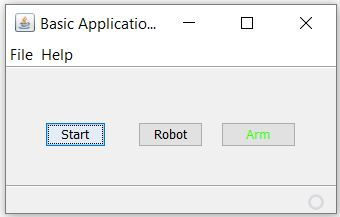

# Introduction
A demonstration of Robot class and automating processes using Java.

# Description
There are three buttons. They do the following sorts of demo automation.

**Start Button:** Open the *Notepad" program.

**Robot Button:** Once the *Arm/Disarm* button is armed, this will do *mouse move* and *click* routines at predefined screen points. Repeats the whole routine in every fifteen minutes over one and half hour. If you change the global variables in the source file, you can adjust the timing.

**Arm/Disarm Button:** Toggles between *Arm* and *Disarm* states. If armed, it activates the *Robot* button.

Apart from them implemented *splash screen*, *animated icons* to indicate acitivy and *about page*.

**Special Notes**: The program was originally intended to run during idle time to automate certain processes. It runs in the main thread and the automation call block the UI. If you run the software and start the automation (i.e., *Robot* button) process, you cannot close it the app until the process is done (default is one and half hour). If needed, you can close the software through Task Manager (no side effects).

# How to run

The *'DesktopApplication1.jar'* in the *dist* folder can be run from Java. Or you can build from the java source and run.

# Project information
**Author:** Dr Arif Khan 
**Language:** Java 
**Built Year:** 2016 
**IDE:** NetBeans IDE 
**License:** MIT

# Screenshot

